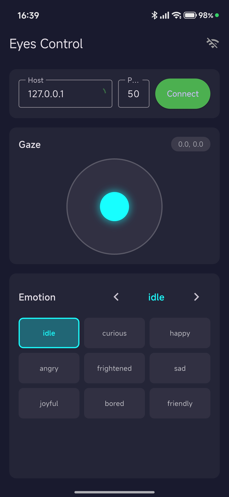

# Robot Eyes

[Türkçe için tıklayın](README_TR.md)

A Flutter-based robot eyes display system for Raspberry Pi with GC9A01 SPI round displays.


## Demo Videos

[](https://youtube.com/shorts/yt5mXC8gClE)

[](https://youtube.com/shorts/3ZRi2_EnEjg)

## Overview

This project consists of two Flutter applications:

- **rpi_eyes** - The eyes display application that runs on a Raspberry Pi and renders animated robot eyes to dual GC9A01 SPI round displays
- **rpi_eyes_control** - A control application (desktop/mobile) that connects to the eyes app via WebSocket to control emotions and gaze direction



## Features

- 9 emotion states: idle, curious, happy, angry, frightened, sad, joyful, bored, friendly
- Smooth gaze control with joystick interface
- Asynchronous blinking animation
- WebSocket communication between control app and eyes app
- UDP broadcast discovery for automatic connection
- Cross-platform control app (macOS, iOS, Android)

## Hardware Requirements

### Display
- 2x [Waveshare 1.28inch GC9A01 LCD Module](https://www.waveshare.com/wiki/1.28inch_LCD_Module) (240x240 resolution)
- Raspberry Pi 4 or Pi 5 (auto-detected)

### Wiring


| Wire Color | Function | Connectivity | Raspberry Pi Pin |
|------------|----------|--------------|------------------|
| Purple | VCC (3.3V) | Shared | Pin 1 / Pin 17 (3.3V) |
| White | GND | Shared | Pin 6 / Pin 9 (GND) |
| Orange | CLK (Clock) | Shared | Pin 23 (SCLK / BCM 11) |
| Green | DIN (Data) | Shared | Pin 19 (MOSI / BCM 10) |
| Blue | DC (Data/Cmd) | Shared | Pin 22 (GPIO 25) |
| Brown | RST (Reset) | Shared | Pin 13 (GPIO 27) |
| Yellow | CS1 (Select) | **UNIQUE** | Disp 1 → Pin 24 (CE0 / BCM 8) |
| Yellow | CS2 (Select) | **UNIQUE** | Disp 2 → Pin 26 (CE1 / BCM 7) |
| Grey | BL (Backlight) | Shared | Pin 12 (GPIO 18) |

> **Note:** All signals except CS (Chip Select) are shared between both displays. Each display requires its own CS line for independent control.
>
> **Note:** The module also accepts 5V on VCC, but the Waveshare example wiring above uses the 3.3V pin (Pin 1). The pins shown match the official Waveshare 1.28" LCD Module Raspberry Pi wiring.
>
> **Note:** With long jumper wires, keep SPI speed at 1 MHz. Higher speeds cause garbled/corrupted images.

### Cable Color Mapping (Old ST7789 → New GC9A01)

If you are rewiring from the previous 0.96-inch ST7789 cable set, use this mapping:

| Function | Old Color | New Color |
|----------|-----------|-----------|
| Ground | Red | White |
| Power | Black | Purple |
| Clock (SCLK) | Yellow | Orange |
| Data (MOSI) | Green | Green |
| Data / Command | White | Blue |
| Reset | Blue | Brown |
| Chip Select | Orange | Yellow |
| Backlight | Purple | Grey |

## Software Setup

### Prerequisites

1. Enable SPI on Raspberry Pi:
   ```bash
   sudo raspi-config
   # Navigate to: Interface Options → SPI → Enable
   ```

2. Enable dual chip select:
   Add to `/boot/config.txt`:
   ```
   dtparam=spi=on
   dtoverlay=spi0-2cs
   ```

3. Add user to GPIO/SPI groups:
   ```bash
   sudo usermod -aG gpio,spi $USER
   ```

4. Reboot the Pi

### Building the Eyes App (on Raspberry Pi)

```bash
cd rpi_eyes
flutter pub get
flutter build linux --release -t lib/main.dart
```

### Running the Eyes App

```bash
./build/linux/arm64/release/bundle/rpi_eyes
```

For VNC/desktop mode (without SPI displays):
```bash
flutter run -d linux
```

### Building the Control App

**macOS:**
```bash
cd rpi_eyes_control
flutter build macos --release
```

**Android:**
```bash
flutter build apk --release
```

**iOS:**
```bash
flutter build ios --release
```

## Usage

1. Start the eyes app on the Raspberry Pi
2. Launch the control app on your phone or computer
3. The control app will automatically discover the eyes app via UDP broadcast
4. Tap to connect, then use the joystick to control gaze and buttons to change emotions

## Network Ports

- **WebSocket:** 5050 (eyes server)
- **UDP Discovery:** 5001 (broadcast)

## Project Structure

```
eyes/
├── rpi_eyes/                 # Eyes display application
│   ├── lib/
│   │   ├── app/              # UI components
│   │   ├── drivers/          # SPI/GC9A01 drivers
│   │   ├── models/           # Data models
│   │   ├── services/         # WebSocket services
│   │   └── main.dart         # Entry point (SPI on Pi, desktop elsewhere)
│   └── ...
├── rpi_eyes_control/         # Control application
│   ├── lib/
│   │   └── main.dart         # Control app UI
│   └── ...
└── docs/                     # Documentation assets
```

## License

This project is open source and available under the [MIT License](LICENSE).

## Acknowledgments

- Display module: [Waveshare 1.28inch GC9A01 LCD Module](https://www.waveshare.com/wiki/1.28inch_LCD_Module)
- Built with [Flutter](https://flutter.dev)
